# Results

## Experiment

Policies were trained on HIV simulator through standard RL setup. Both regular viersions as well as modified *causal* versions were tried. The Causal versions of each algorithm involve calculating a causal factor which is used to scale the advantage during policy training.

Algorithms tested -

1. Vanilla Policy Gradient
2. Proximal Policy Optimization

After training, the algorithms are compared with a MaxTreatment, NoTreatment and Random policy.

## Training Rewards

### Vanilla Policy Gradient Training

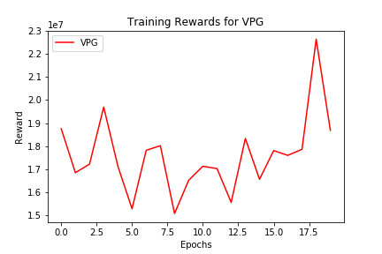

### Causal Policy Gradient Training

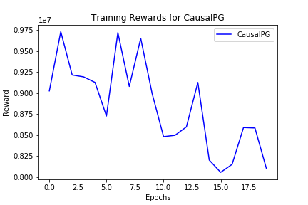

### Proximal Policy Optimisation Training

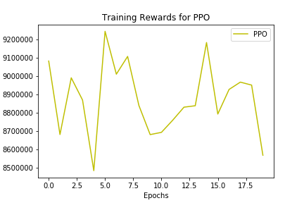

### Causal Proximal Policy Optimisation Training

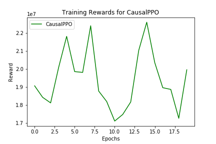

### Combined Training Results

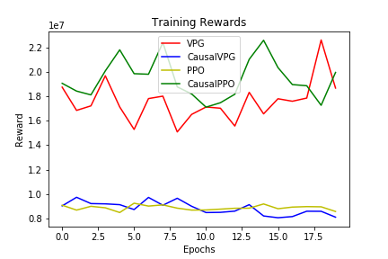

## Causal Factor During Training

### Causal PG Causal Factor

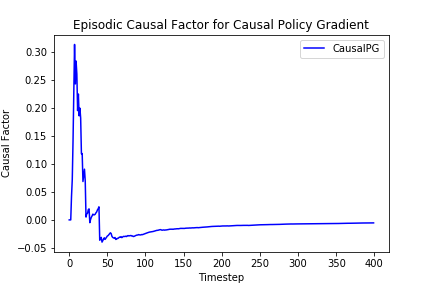
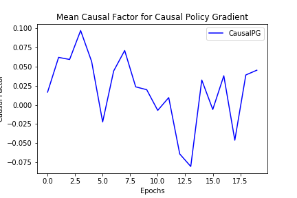

### Causal PPO Causal Factor

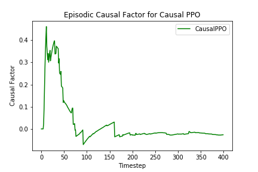
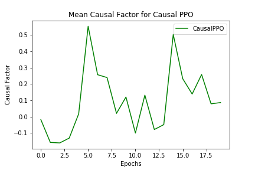

### Combined Causal Factor Results

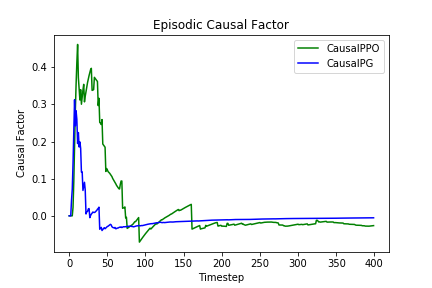
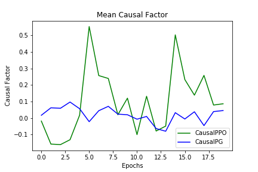

## Trained Behavior Evaluation

### Vanilla Policy Gradient Evaluation

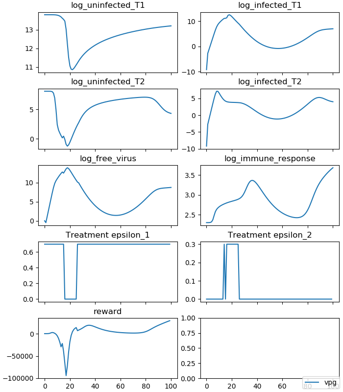
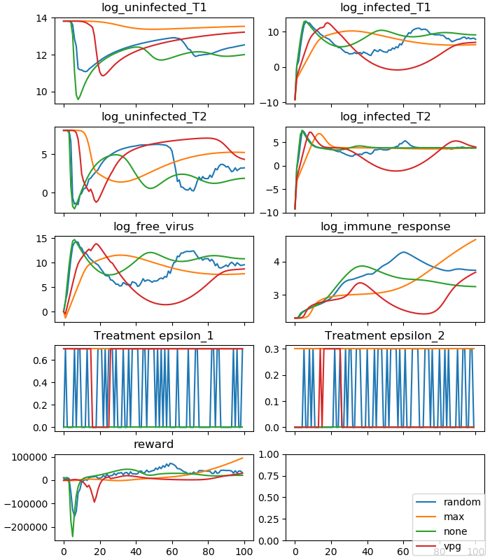

### Causal Policy Gradient Evaluation

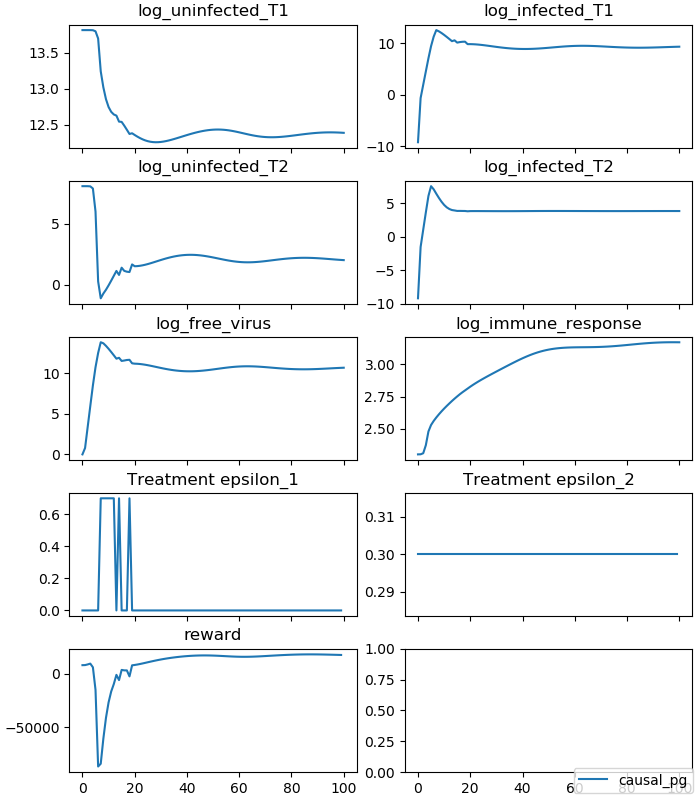
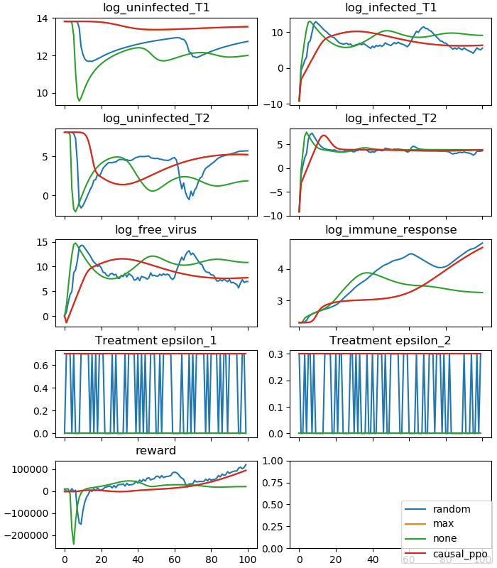

### Proximal Policy Optimisation Evaluation

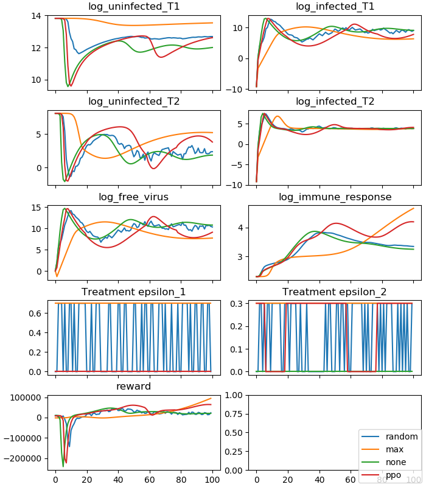
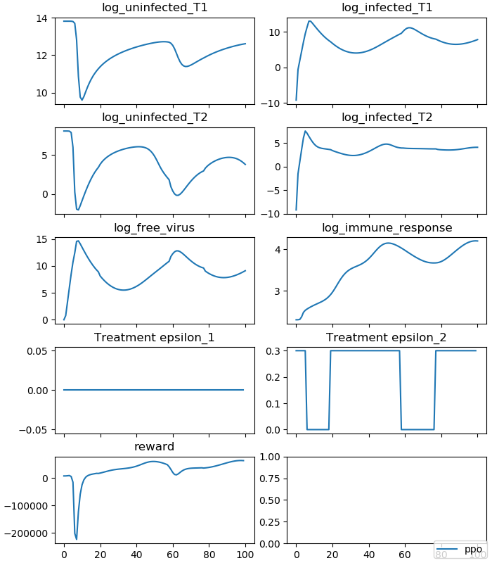

### Causal Proximal Policy Optimisation Evaluation

### Combined Evaluation Results

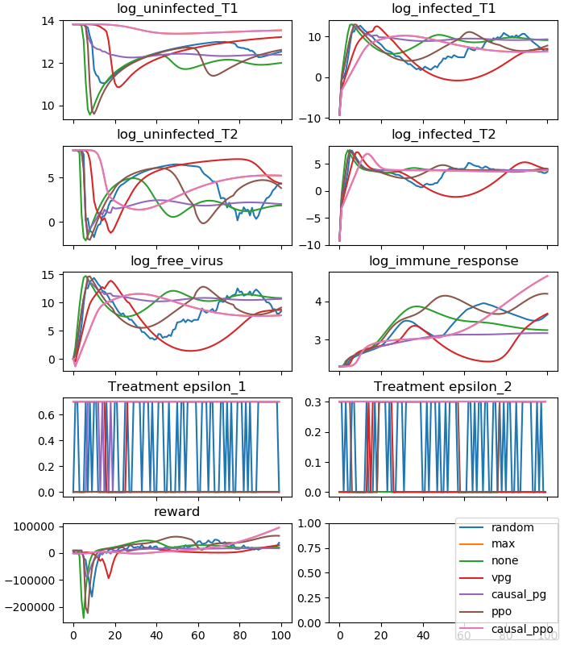
